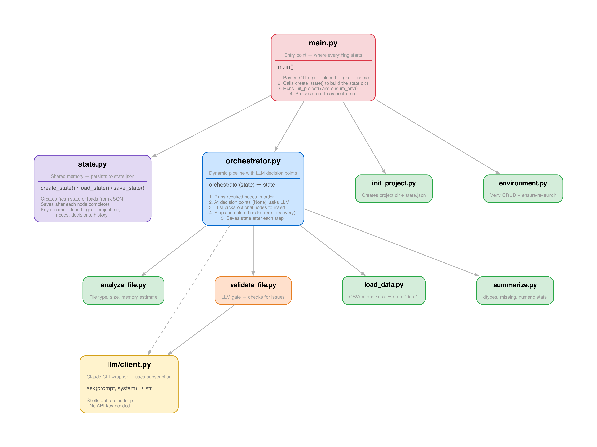
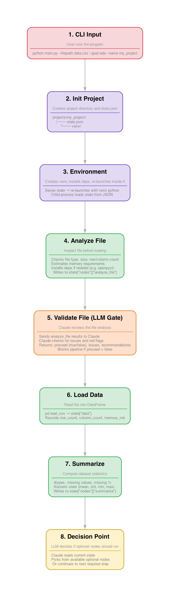

# ai-ds

Automated data science pipeline that evolves from deterministic node functions to LLM-orchestrated workflows.

## How it works

```
python main.py --filepath data.csv --goal eda --name my_project
```

Creates a project directory at `projects/my_project/` with its own venv and state.json. The orchestrator runs required nodes in sequence, with LLM decision points where Claude can insert optional steps.

## Project structure

```
main.py                         # Entry point — CLI args → init → env → orchestrator
src/
├── state.py                    # State creation, persistence (save/load JSON)
├── orchestrator.py             # Dynamic pipeline with LLM decision points
├── llm/
│   └── client.py               # Claude CLI wrapper (uses subscription, no API key)
└── nodes/
    ├── init_project.py         # Creates project dir + state.json
    ├── environment.py          # Venv CRUD + re-launch
    ├── analyze_file.py         # File type, size, memory estimate, dep install
    ├── validate_file.py        # LLM gate — Claude checks for issues before loading
    ├── load_data.py            # Reads file into DataFrame
    └── summarize.py            # dtypes, missing values, numeric stats
docs/
├── generate_file_hierarchy.py  # File/function hierarchy diagram generator
├── generate_flow.py            # Runtime flow diagram generator
├── file_hierarchy.png
└── flow.png
```

## Pipeline

Required nodes run in order. Decision points (marked by `None` in the pipeline) ask Claude which optional nodes to insert.

```
init_project → environment → analyze_file → validate_file (LLM gate)
→ load_data → summarize → [LLM decision point]
```

**Error recovery:** State saves after each node. Re-running the same command skips completed steps and resumes from where it failed.

## Architecture



## Runtime Flow


